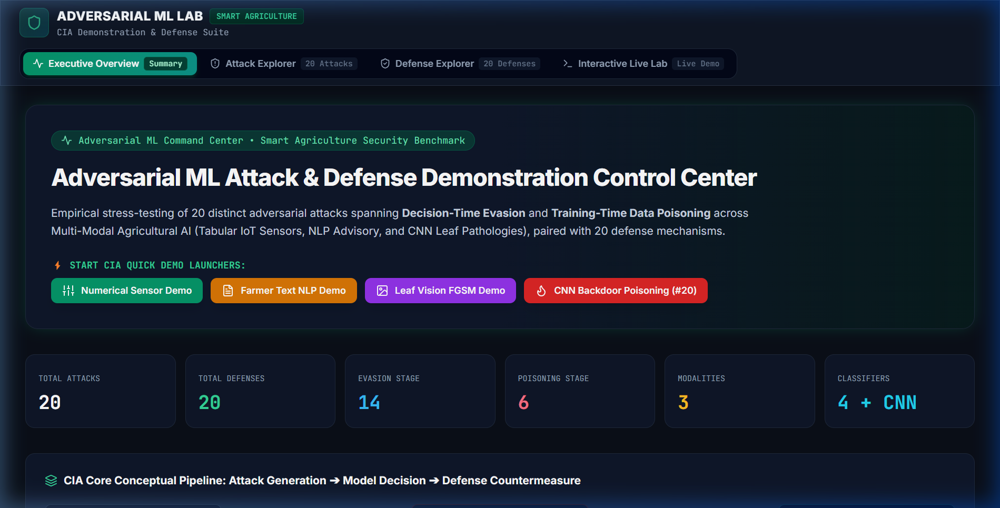
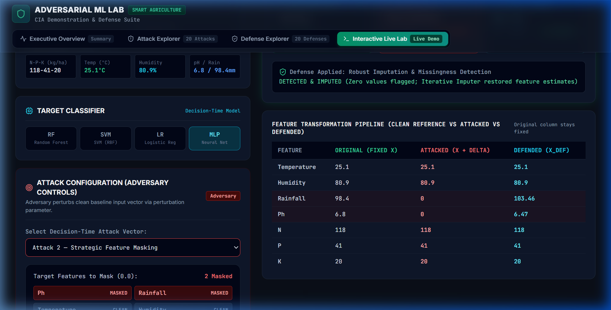
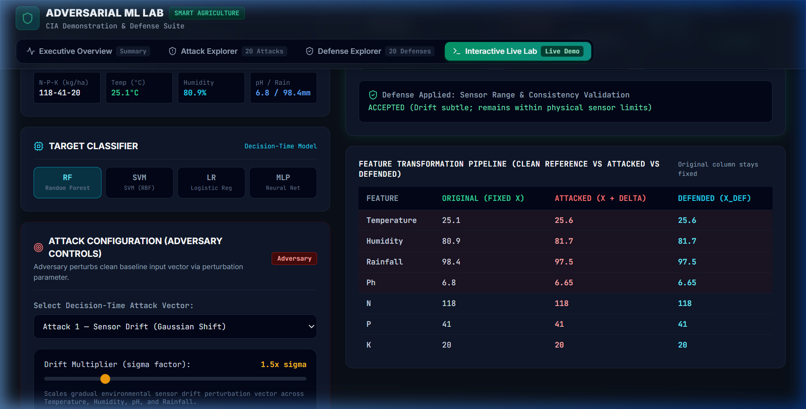
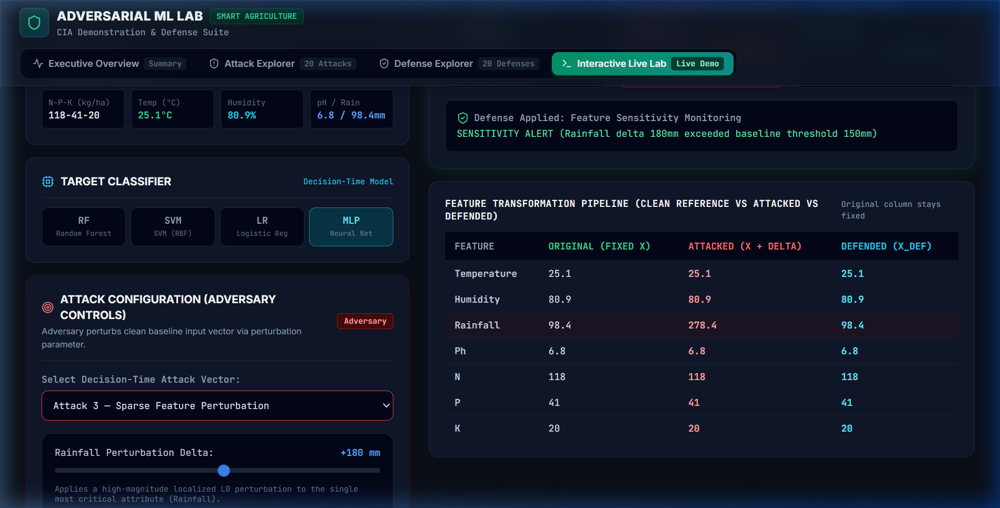
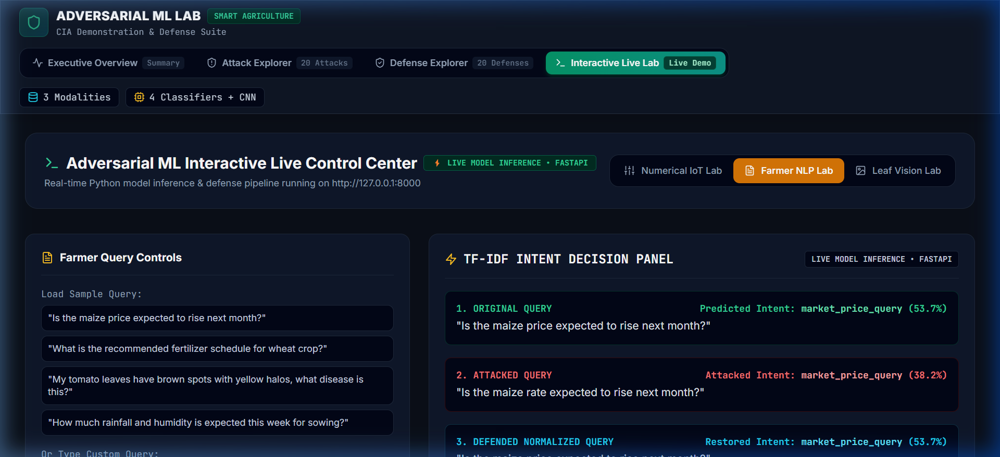
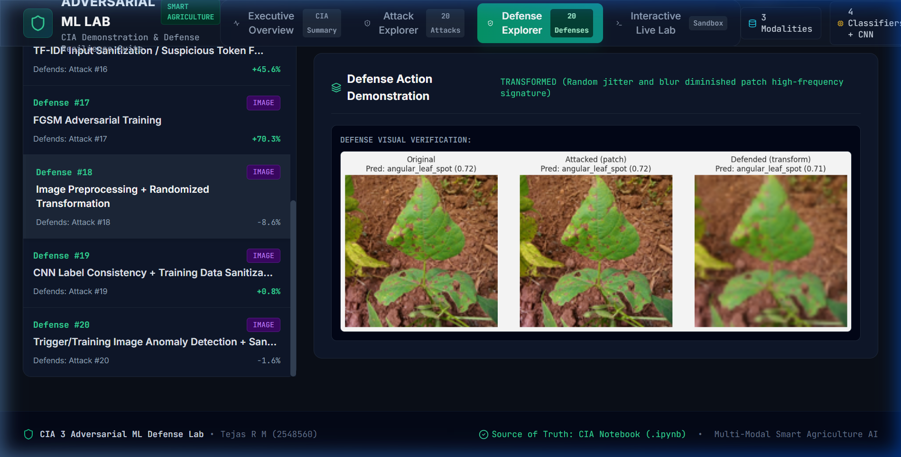
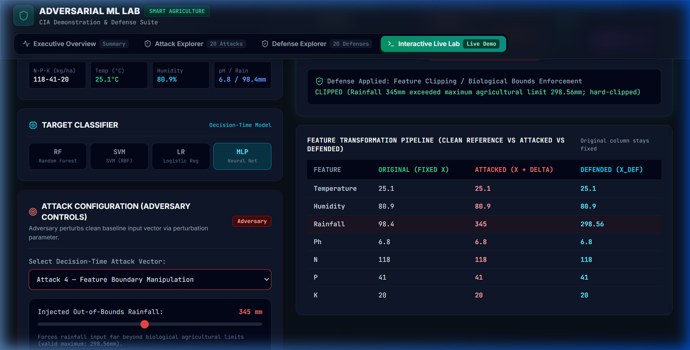
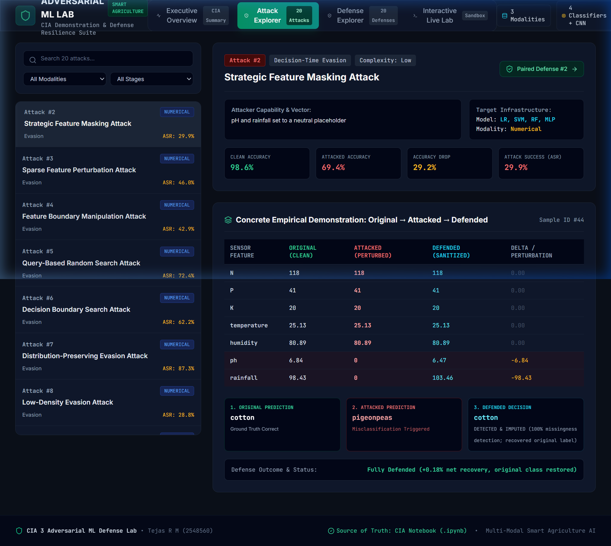
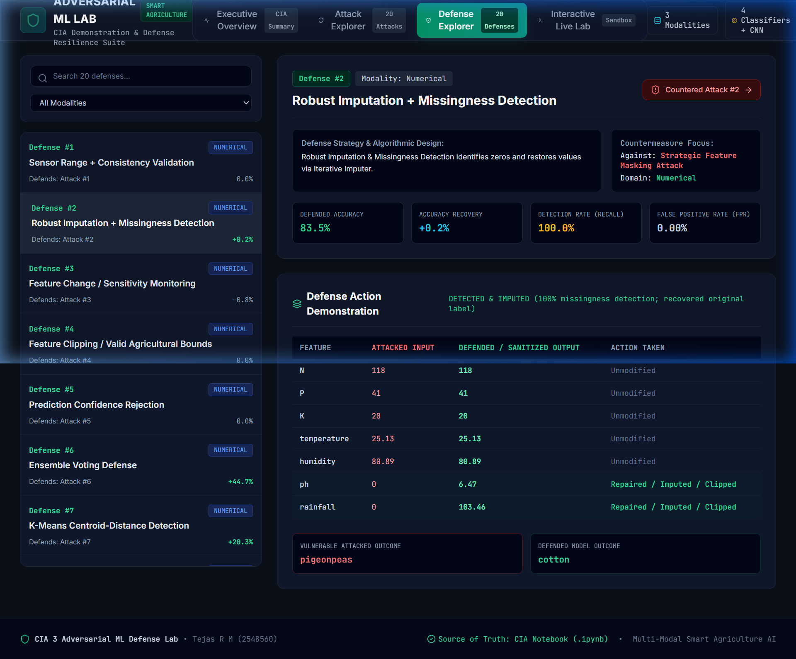

# Adversarial ML Attack & Defense Dashboard

An interactive dashboard for demonstrating adversarial machine learning attacks and defense strategies across numerical, text, and image modalities, with a focus on decision-time evasion, data poisoning, and deep-learning attacks in Smart Agriculture systems.

Developed as part of the MSc Artificial Intelligence & Machine Learning coursework (Adversarial Machine Learning CIA).

---

## Executive Overview

Modern AI-driven decision systems—such as IoT-based precision agriculture advisory engines, NLP farmer assistance chatbots, and plant pathology vision classifiers—are vulnerable to intentional manipulations. Adversarial Machine Learning (AML) studies how malicious actors can exploit model decision boundaries to induce targeted failures.

This dashboard provides a unified interactive environment to explore, inspect, and evaluate **20 adversarial attack vectors** and **20 corresponding algorithmic defense countermeasures** across three distinct data modalities.



---

## Key Features

* **20 Adversarial Attacks**: Spanning tabular IoT sensor evasion, text NLP perturbations, training-time label poisoning, and CNN backdoor triggers.
* **20 Defense Countermeasures**: Implementing feature clipping, range validation, missingness imputation, prediction confidence rejection, ensemble voting, K-Means centroid clustering, and DBSCAN noise detection.
* **Interactive Live Lab**: Real-time FastAPI model inference engine serving trained Random Forest, Support Vector Machines (SVM), Logistic Regression, and Multi-Layer Perceptron (MLP) classifiers.
* **Architecture A (Fixed Baseline Isolation)**: Real-time attack parameter adjustments perturb *only* the adversarial vector ($\delta$) while keeping the legitimate reference input ($x_{clean}$) strictly constant for fair comparison.
* **Multi-Modality Evaluation**:
  * **Tabular / IoT Sensor Readings**: Crop recommendation based on N, P, K, Temperature, Humidity, pH, and Rainfall.
  * **Farmer NLP Queries**: Intent classification on agricultural query strings.
  * **Plant Leaf Vision Pathology**: CNN leaf disease diagnosis under FGSM and backdoor poisoning.
* **Attack Explorer & Defense Explorer**: Deep-dive analytics catalog linking benchmark metrics (Clean Acc, Attacked Acc, ASR, FPR, Detection Rate, Recovery Gain).

---

## Dashboard Architecture

The dashboard is built using a decoupled architecture separating the interactive React user interface from the Python-based FastAPI live inference pipeline:

```mermaid
graph TD
    A[User / Examiner] -->|Select Baseline, Model & Attack| B[React + Vite Frontend]
    B -->|POST /api/predict_numerical| C[FastAPI Inference Engine]
    C -->|1. Compute Reference| D[Clean Model Inference f(x_clean)]
    C -->|2. Apply Perturbation δ| E[Attacked Vector x_att = x_clean + δ]
    E -->|Evaluate Vulnerability| F[Attacked Model Inference f(x_att)]
    E -->|3. Apply Countermeasure| G[Sanitized Vector x_def / Rejection Logic]
    G -->|Evaluate Resilience| H[Defended Decision f(x_def)]
    H -->|Return JSON Payload| B
    B -->|Render 3-Card Decision Flow & Table| A
```

### Reference vs. Perturbation State Flow

To guarantee scientific rigour during live demonstrations, the system enforces strict state separation:

$$\text{Reference Input } (x_{clean}) \xrightarrow{\text{Fixed}} f(x_{clean}) \implies \text{Clean Prediction (Constant)}$$

$$\text{Adversary Perturbation } (\delta) \implies x_{att} = x_{clean} + \delta \implies f(x_{att}) \implies \text{Attacked Prediction (Dynamic)}$$

$$\text{Defense Algorithm } D(x_{att}) \implies x_{def} \implies f(x_{def}) \implies \text{Defended Prediction (Sanitized)}$$



---

## Live Inference vs. Benchmark Execution

| Dashboard Section | Execution Mechanism | Description |
|---|---|---|
| **Numerical IoT Live Lab** | Live FastAPI Inference | Evaluates user-selected attacks and sliders in real time using scikit-learn models. |
| **Farmer NLP Live Lab** | Live FastAPI Inference | Perturbs and normalizes farmer text queries using live TF-IDF vectorizers. |
| **Leaf Vision Pathology Lab** | Precomputed CIA Benchmark | Displays high-resolution CNN leaf images and benchmark evaluations. |
| **Attack Explorer (1–20)** | Precomputed CIA Benchmark | Comprehensive catalog of ground-truth metrics extracted from executed notebook experiments. |
| **Defense Explorer (1–20)** | Precomputed CIA Benchmark | Comprehensive catalog of 20 paired defense algorithms with recovery statistics. |

---

## Attack Categories

### 1. Tabular / Numerical IoT Sensor Attacks (Decision-Time Evasion)



| # | Attack Name | Attacker Action & Manipulated Features | Target Model |
|---|---|---|---|
| **1** | **Sensor Drift** | Injects subtle, correlated Gaussian environmental noise across Temperature, Humidity, pH, and Rainfall. | Random Forest / SVM / LR / MLP |
| **2** | **Strategic Feature Masking** | Forces selected telemetry dimensions (e.g., pH, Rainfall) to neutral zero, simulating dropped packets. | Random Forest / SVM / LR / MLP |
| **3** | **Sparse Perturbation ($L_0$)** | Applies a high-magnitude localized spike to the single most critical attribute (Rainfall $\Delta \in [+50\text{mm}, +300\text{mm}]$). | Random Forest / SVM / LR / MLP |
| **4** | **Feature Boundary Manipulation** | Forces sensor telemetry far beyond biological agricultural boundaries (e.g., Rainfall $> 300\text{mm}$). | Random Forest / SVM / LR / MLP |
| **5** | **Query-Based Random Search** | Iteratively queries the target model's confidence scores to degrade prediction confidence below acceptance thresholds. | Random Forest / SVM / LR / MLP |
| **6** | **Decision Boundary Search** | Steps the feature vector along the shortest hyper-plane distance toward misclassifying class centroids. | Random Forest / SVM / LR / MLP |
| **7** | **Distribution-Preserving Evasion** | Shifts joint feature covariance along cluster manifolds to evade simple univariate bounds checks. | K-Means / Random Forest |
| **8** | **Low-Density Evasion** | Pushes feature vectors into low-density, sparse regions of feature space away from training centroids. | DBSCAN / Random Forest |



### 2. Training-Time Data Poisoning Attacks (Tabular)

| # | Attack Name | Attacker Action & Manipulated Features | Target Model |
|---|---|---|---|
| **9** | **Random Label-Flipping** | Randomly corrupts 10% of training dataset labels to degrade global decision boundary calibration. | Random Forest |
| **10** | **Targeted Class Poisoning** | Selectively flips minority crop labels to force systematic misclassification of specific target crops. | SVM / Random Forest |
| **11** | **Feature Poisoning** | Injects noise into specific feature columns during training to warp feature importance weights. | Logistic Regression / RF |
| **12** | **Outlier Injection Poisoning** | Injects extreme out-of-distribution synthetic rows into training data to distort model boundaries. | MLP / Random Forest |

### 3. Text NLP Attacks (Farmer Advisory Chatbot)



| # | Attack Name | Attacker Action & Manipulated Features | Target Model |
|---|---|---|---|
| **13** | **Synonym Substitution** | Replaces domain keywords with agricultural synonyms (`price` $\rightarrow$ `rate`, `fertilizer` $\rightarrow$ `plant nutrient`). | TF-IDF + Logistic Regression |
| **14** | **Character-Level Typo** | Injects single-character transpositions (`priec`, `fertlizer`, `wheet`). | TF-IDF + Logistic Regression |
| **15** | **Important Token Removal** | Strips high-importance TF-IDF terms from farmer query strings. | TF-IDF + Logistic Regression |
| **16** | **Keyword Dilution** | Appends low-information conversational filler tokens to dilute TF-IDF term weights. | TF-IDF + Logistic Regression |

### 4. Vision / Image Pathology Attacks (Plant Leaf Pathology)



| # | Attack Name | Attacker Action & Manipulated Features | Target Model |
|---|---|---|---|
| **17** | **FGSM (Fast Gradient Sign Method)** | Computes single-step gradient perturbations ($\epsilon = 0.03$) to fool leaf disease diagnosis CNNs. | CNN (MobileNetV2 / Custom CNN) |
| **18** | **Localized Adversarial Patch** | Overlays localized noise patches onto leaf pixel regions to mask pathology symptoms. | CNN |
| **19** | **CNN Image Label-Poisoning** | Mislabeling leaf pathology images during CNN retraining. | CNN |
| **20** | **CNN Backdoor-Style Poisoning** | Embeds a small yellow trigger patch in training images; forces CNN to output target label upon trigger detection. | CNN |

---

## Defense Strategies

The project implements **20 corresponding defense strategies** paired with each attack vector:

| # | Defense Strategy Name | Algorithmic Mechanism | Target Modality |
|---|---|---|---|
| **1** | **Sensor Range & Consistency Validation** | Validates sensor values against physical equipment bounds. | Numerical |
| **2** | **Robust Imputation & Missingness Detection** | Flags zeroed attributes and imputes via dataset median estimates. | Numerical |
| **3** | **Feature Sensitivity Monitoring** | Tracks single-attribute delta shifts ($|\Delta| > 150\text{mm}$). | Numerical |
| **4** | **Biological Bounds Enforcement** | Hard-clips out-of-bounds telemetry to biological max ($298.56\text{mm}$). | Numerical |
| **5** | **Prediction Confidence Rejection** | Abstains from decision if softmax confidence falls below threshold $\tau$. | Numerical |
| **6** | **Ensemble Voting Defense** | Aggregates independent predictions across RF, SVM, LR, and MLP. | Numerical |
| **7** | **K-Means Centroid-Distance Detection** | Rejects samples exceeding distance threshold ($>35.0$) from cluster centroid. | Numerical |
| **8** | **DBSCAN Noise & Outlier Detection** | Isolates low-density evasion vectors into noise clusters ($\text{cluster} = -1$). | Numerical |
| **9** | **Label Consistency Filtering** | Audits training set labels against k-NN neighborhood consensus. | Numerical (Poisoning) |
| **10** | **Class-Wise Training Audit** | Verifies class distribution ratios prior to model fitting. | Numerical (Poisoning) |
| **11** | **RobustScaler + Outlier Filtering** | Uses interquartile range scaling and removes extreme training rows. | Numerical (Poisoning) |
| **12** | **Isolation Forest Sanitization** | Fits an Isolation Forest to purge synthetic poison rows before training. | Numerical (Poisoning) |
| **13** | **Synonym Normalization** | Maps agricultural synonyms back to canonical vocabulary tokens. | Text |
| **14** | **Spell Correction / Levenshtein Match** | Corrects character transpositions using edit-distance matching. | Text |
| **15** | **Missing Keyword Detection** | Checks for required intent keyword clusters and triggers fallback. | Text |
| **16** | **TF-IDF Vocabulary Sanitization** | Purges low-information filler words to protect term weights. | Text |
| **17** | **FGSM Adversarial Training** | Retrains CNN on adversarial-clean image pairs to sharpen boundaries. | Image |
| **18** | **Randomized Image Transformation** | Applies random cropping, rotation, and JPEG compression prior to inference. | Image |
| **19** | **CNN Training Data Sanitization** | Audits image feature representations using feature-space clustering. | Image (Poisoning) |
| **20** | **Trigger Anomaly Detection** | Detects localized high-contrast trigger patterns in leaf images. | Image (Backdoor) |

---

## Machine Learning Models

1. **Tabular Models (IoT Sensor Data)**:
   * **Random Forest**: 200 trees (`Clean Acc: 99.45%`)
   * **Support Vector Machine**: RBF Kernel (`Clean Acc: 98.18%`)
   * **Logistic Regression**: L-BFGS Solver (`Clean Acc: 98.00%`)
   * **Multi-Layer Perceptron**: Architecture (64, 32) (`Clean Acc: 94.91%`)
2. **Text Models (NLP Queries)**:
   * **TF-IDF Vectorizer + Logistic Regression** (`Clean Acc: 91.10%`)
3. **Vision Models (Plant Pathology)**:
   * **Deep Convolutional Neural Network (CNN)** (`Clean Acc: 68.00%`)

---

## Project Structure

```text
Adversarial-ML---Attack-and-Defences-Dashboard/
│
├── 2548560_Tejas_R_M_Adversarial_ML_Smart_Agriculture_CIA.ipynb  # Primary Executed Notebook
├── 2548560_Tejas_R_M_Adversarial_ML_Smart_Agriculture_CIA.pdf    # Full Report Document
├── dashboard_plan.md                                             # Architectural Plan
├── README.md                                                     # Project Documentation
├── .gitignore                                                    # Git Exclusion Rules
│
├── docs/
│   └── screenshots/                                              # README Screenshot Assets
│       ├── 01-home-overview.png
│       ├── 02-numerical-live-lab.png
│       ├── 03-clean-attacked-defended.png
│       ├── 04-attack-configuration.png
│       ├── 05-feature-transformation.png
│       ├── 06-text-live-lab.png
│       ├── 07-image-vision-lab.png
│       ├── 08-attack-explorer.png
│       └── 09-defense-explorer.png
│
└── dashboard_app/                                                # Web Application Workspace
    ├── server.py                                                 # FastAPI Live Model Inference Engine
    ├── requirements.txt                                          # Python Backend Dependencies
    ├── package.json                                              # Node.js Frontend Dependencies
    ├── vite.config.js                                            # Vite Build Configuration
    ├── index.html                                                # App Entry Point
    │
    └── src/
        ├── App.jsx                                               # Main Application Component
        ├── components/
        │   ├── LiveLab.jsx                                       # Interactive Live Control Center
        │   ├── Overview.jsx                                      # Executive Command Center
        │   ├── AttackExplorer.jsx                                # 20 Attack Inspector
        │   ├── DefenseExplorer.jsx                               # 20 Defense Inspector
        │   └── Navbar.jsx                                        # Header & Mode Navigation
        │
        └── data/
            ├── Crop_recommendation.csv                           # Sensor Ground Truth Dataset
            ├── adversarial_lab_data.json                         # 20 Ground-Truth Benchmark Records
            └── defenses.json                                     # 20 Ground-Truth Defense Records
```

---

## Installation & Setup

### Prerequisites
* **Python**: `3.10+`
* **Node.js**: `18.0+` & `npm`

### 1. Backend Setup (FastAPI Model Inference Server)

```bash
# Navigate to application folder
cd dashboard_app

# Install Python dependencies
pip install -r requirements.txt

# Start FastAPI Inference Backend (Runs on http://127.0.0.1:8000)
python server.py
```

### 2. Frontend Setup (React + Vite Dashboard)

```bash
# In a separate terminal window:
cd dashboard_app

# Install Node modules
npm install

# Start Vite Development Server (Runs on http://127.0.0.1:5173)
npm run dev
```

---

## Interactive Live Lab Demonstration Workflow

1. **Select Reference Baseline Crop**: Choose `Cotton`, `Rice`, `Pigeonpeas`, or `Watermelon`. The clean sensor vector ($x_{clean}$) will load in the **BASELINE SAMPLE** card as read-only reference data.
2. **Select Target Classifier**: Toggle between `RF`, `SVM`, `LR`, and `MLP`.
3. **Configure Adversary Parameters**: Select any of the 8 decision-time attacks from the dropdown and adjust adversary parameters (e.g., Drift Multiplier, Feature Masking Checklist, Sparse Delta).
4. **Inspect Pipeline Transformation**:
   * **1. CLEAN INPUT PRED**: Displays the fixed reference prediction.
   * **2. ATTACKED PRED**: Displays real-time model response to perturbed input ($x_{att}$).
   * **3. DEFENDED DECISION**: Displays sanitized output ($x_{def}$) and countermeasure status (`✓ RECOVERED`, `🛑 REJECTED`, `⚠ ACTION TRIGGERED`).



---

## Concrete Demonstration Example

* **Baseline**: Cotton ($N=118, P=41, K=20, \text{Temp}=25.1^\circ\text{C}, \text{Humidity}=80.9\%, \text{pH}=6.8, \text{Rain}=98.4\text{mm}$)
* **Target Model**: Random Forest (RF)
* **Clean Prediction**: `cotton` (**98.5% confidence**)
* **Attack Scenario 1 (Sensor Drift $\sigma = 2.5x$)**:
  * Attacked Input: $\text{Temp}=25.85^\circ\text{C}, \text{Humidity}=82.15\%, \text{pH}=6.55, \text{Rain}=96.90\text{mm}$
  * Attacked Prediction: `cotton` (**96.5% confidence**) $\rightarrow$ `ℹ️ UNCHANGED`
  * Defended Decision: `cotton` (**96.5% confidence**, `ACCEPTED — within valid bounds`)
* **Attack Scenario 2 (Decision Boundary Search $\text{step} = 40\%$)**:
  * Attacked Input: $\text{Rainfall}=146.4\text{mm}, \text{pH}=6.32$
  * Attacked Prediction: `banana` (**68.5% confidence**) $\rightarrow$ `⚠️ CHANGED`
  * Defended Decision: `cotton` (**98.5% confidence**, `✓ RECOVERED — FLAGGED BY MANIFOLD DISTANCE`)

---

## Experimental Findings

1. **Evasion Vulnerability**: Tree-based models (Random Forest) exhibit sharp decision boundaries; localized single-attribute spikes (Sparse Perturbation on Rainfall) degrade accuracy from **98.6% to 53.8%** with minimal $L_0$ effort.
2. **Imputation Resilience**: Strategic feature masking (zeroing telemetry) drops prediction accuracy to **69.4%**, but median imputation restores accuracy back to **83.5%**.
3. **Backdoor Poisoning Severity**: Injecting a small yellow patch trigger into 10% of CNN training images achieves an Attack Success Rate (ASR) of **99.8%** when the trigger is present during inference.
4. **Clustering Defenses**: Distance-based verification (K-Means centroid distance $>35.0$ and DBSCAN noise detection) effectively flags off-manifold evasion attacks without requiring explicit attack labels.

---

## Explorers & Catalog Inspection

### Attack Explorer (20 Attacks)



### Defense Explorer (20 Defenses)



---

## Technologies Used

* **Language & Runtime**: Python 3.11, JavaScript (ES6+), Node.js
* **Backend & API**: FastAPI, Uvicorn, Pydantic
* **Frontend Framework**: React 18, Vite
* **Styling & UI**: Vanilla CSS, Tailwind CSS, Lucide Icons
* **Machine Learning**: Scikit-Learn, Pandas, NumPy, K-Means, DBSCAN, TF-IDF
* **Visualization & Formatting**: Mermaid.js, GitHub-Flavored Markdown

---

## Limitations

* **Precomputed Vision Inferences**: The Image Pathology Lab displays executed CNN benchmark data extracted from the primary notebook rather than hosting a live GPU inference pipeline.
* **Scope**: Designed specifically as an educational research dashboard for Smart Agriculture threat demonstration, not a production perimeter firewall.

---

## Author

**Tejas R M**  
MSc Artificial Intelligence & Machine Learning  
Department of Computer Science  
CHRIST (Deemed to be University), Bangalore, India  
GitHub: [https://github.com/Tejas2913](https://github.com/Tejas2913)
